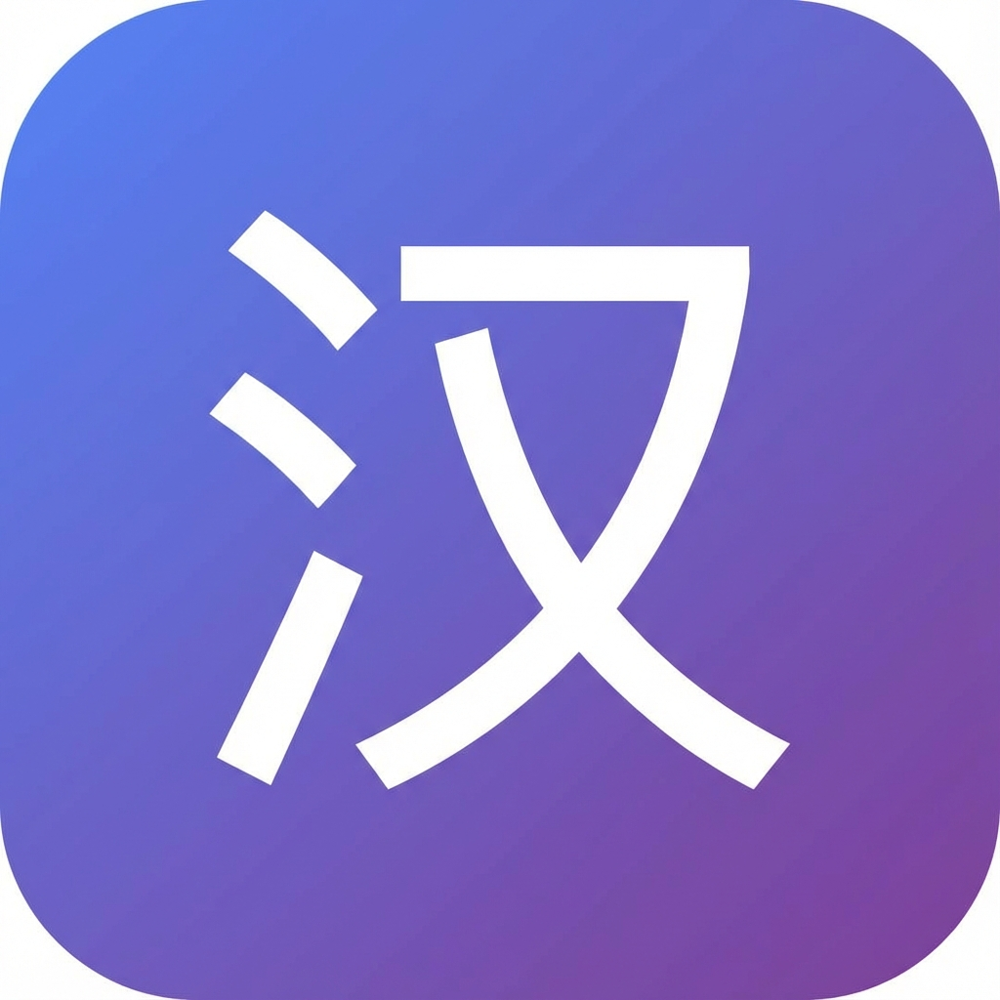

# Chinese Language Translation Tool 📚

A beautiful, iPad-optimized web application that allows you to upload PDF files and translate Chinese text to English or Thai using OCR and AI-powered translation.



## ✨ Features

- 📄 **PDF Viewer** - Upload and view PDF documents with smooth page navigation
- 🎯 **Draggable Selection Box** - Intuitive touch-based selection for text regions
- 🔤 **OCR Technology** - Extract Chinese characters using Tesseract.js
- 🌏 **AI Translation** - Translate to English or Thai using Gemini API
- 📱 **iPad Optimized** - Perfect viewport and touch interactions for iPad
- 💎 **Premium UI** - Modern glassmorphic design with vibrant gradients
- 🔄 **PWA Support** - Install to home screen for app-like experience

## 🚀 Quick Start

### Prerequisites

- A modern web browser (Chrome, Safari, Edge)
- Gemini API key from [Google AI Studio](https://aistudio.google.com/app/apikey)

### Setup

1. **Add your API key**
   - Open the `.env` file
   - Replace `your_gemini_api_key_here` with your actual Gemini API key:
   ```
   VITE_GEMINI_API_KEY=your_actual_key_here
   ```

2. **Run the application**
   ```bash
   npx -y serve -l 3000
   ```

3. **Open in browser**
   - Navigate to `http://localhost:3000`
   - Or use iPad Safari for best experience

### Alternative: Configure API Key in App

If you prefer not to use a `.env` file:
1. Open the app in your browser
2. Click the settings icon (⚙️) in the header
3. Enter your Gemini API key
4. Select your preferred translation language
5. Click "Save Settings"

## 📖 How to Use

1. **Upload PDF**
   - Click "Choose PDF File" or drag & drop a PDF with Chinese text

2. **Navigate PDF**
   - Use ◀️ ▶️ arrows to change pages
   - Use zoom controls to adjust view size

3. **Select Text Area**
   - Drag the purple selection box over Chinese text
   - Resize using corner handles for precise selection

4. **Translate**
   - Click the "Translate" button below the selection box
   - Wait for OCR to extract text
   - View translation in the popup modal

## 🛠️ Technology Stack

- **Frontend**: Vanilla JavaScript (ES6 Modules)
- **PDF Rendering**: [PDF.js](https://mozilla.github.io/pdf.js/)
- **OCR**: [Tesseract.js](https://tesseract.projectnaptha.com/) (Chinese language packs)
- **Translation**: [Google Gemini API](https://ai.google.dev/) (gemini-2.0-flash-exp)
- **Styling**: Modern CSS with glassmorphism and gradients

## 📁 Project Structure

```
Chinese language tool/
├── index.html              # Main HTML structure
├── styles.css              # Comprehensive styling
├── app.js                  # Main application coordinator
├── pdf-viewer.js           # PDF rendering module
├── selection-box.js        # Draggable selection component
├── ocr-service.js          # Tesseract OCR integration
├── translation-service.js  # Gemini API translation
├── manifest.json           # PWA configuration
├── .env                    # Environment variables (API key)
├── .env.example            # Example environment file
└── icons/                  # App icons for PWA
    ├── icon-180.png
    └── icon-512.png
```

## 🎨 Design Features

- **Glassmorphic UI** - Modern blur effects and transparency
- **Vibrant Gradients** - Purple-blue color scheme
- **Smooth Animations** - Polished micro-interactions
- **Touch-Optimized** - 44px minimum touch targets
- **Responsive** - Adapts to iPad portrait and landscape

## 🔐 Privacy & Security

- All OCR processing happens **client-side** in your browser
- Your PDF files are **never uploaded** to any server
- Only extracted text is sent to Gemini API for translation
- API key is stored locally in your browser's localStorage

## 🌐 Browser Compatibility

- ✅ Safari (iOS/iPadOS 14+)
- ✅ Chrome/Edge (Desktop & Mobile)
- ✅ Firefox (Desktop & Mobile)

## 📝 Notes

- **First Load**: OCR models download on first use (~2-3 seconds)
- **Accuracy**: OCR works best with clear, high-contrast text
- **API Costs**: Gemini API has a free tier; check Google AI Studio for details

## 🤝 Contributing

This is a single-file web application designed for simplicity and ease of use. Feel free to modify and extend!

## 📄 License

MIT License - feel free to use this project however you like!

---

**Made with ❤️ for language learners**
